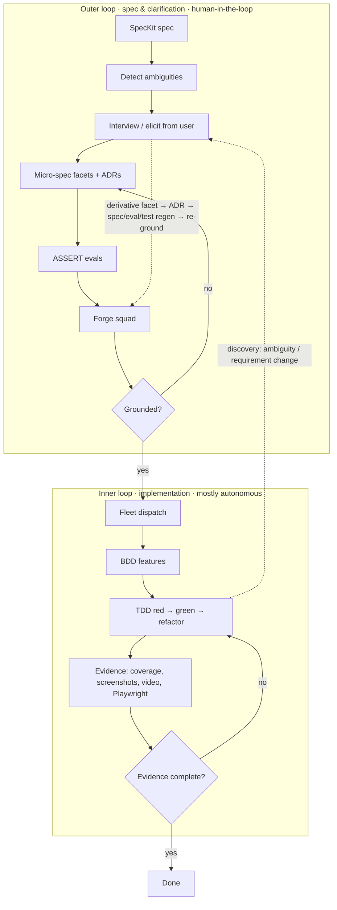

# Agentic SDLC: spec-grounded squads with evidence

This repository ships an **agentic SDLC** workflow: a Copilot custom agent (the
`sdlc` orchestrator) plus a TypeScript toolkit (`sdlc/`, the "squad forge") that
takes a [SpecKit](https://github.com/github/spec-kit) feature spec from *ambiguous*
to *implemented-with-evidence*. It combines four ideas:

| Building block | Role here |
| --- | --- |
| **GitHub SpecKit** | Source of truth. Specs live in `specs/NNN-slug/` (`spec.md`, `plan.md`, `tasks.md`). |
| **Copilot SDK sdk-style squads** | Squad members are Copilot **custom agents**; the squad runs as a parallel **fleet**. |
| **ASSERT framework** | Natural-language specs become executable **evals** that generate *and* police the squad. |
| **Copilot SDK inference** | Crafts each squad member's grounded system prompt (with an offline-deterministic fallback). |

## The loop

The workflow is **two nested loops**: a slow, human-in-the-loop **outer loop** that
owns the *meaning* of the feature (interview → facets/ADRs → grounded squad → evals),
and a fast, mostly autonomous **inner loop** that owns the *implementation*
(BDD → TDD red/green/refactor → evidence). Crucially, the inner loop **feeds back
into the outer loop**: when writing tests or code surfaces hidden ambiguity or a
needed requirement change, the inner loop pauses and escalates rather than guessing.



### Inner & outer loops in detail

- **Outer loop (spec/clarification).** Decides *what* is true and *why*. The only
  place a requirement's intent may change. Always ends by re-running the grounding
  proof so the squad maps 1:1 onto the (possibly revised) spec.
- **Inner loop (implementation).** Decides *how* to satisfy an already-pinned
  requirement, per requirement, via red → green → refactor.
- **Feedback (inner → outer).** Implementation is where hidden ambiguity hides — a
  test you can't write, an unnamed edge case, a false assumption, a constraint the
  code reveals. The inner loop must escalate, not guess:
  1. the squad member raises the discovery (what, which requirement id, why blocked);
  2. the orchestrator opens a **derivative facet** — a micro-spec facet spawned by an
     implementation discovery, linked to the triggering requirement (and its parent
     facet, if any);
  3. if it needs the user, a **targeted re-interview** asks only the new question(s);
  4. if the answer **revises a requirement**, an ADR is recorded, the SpecKit spec is
     updated, and the squad is **re-forged/re-grounded** with the affected evals,
     features, and TDD entries regenerated before the inner loop resumes;
  5. if it merely *enriches*, the derivative facet alone is enough and the inner loop
     resumes.

  Expect several of these bounces per feature; each leaves a durable provenance trail
  and keeps the squad provably grounded after every revision.

### 1. Interview (resolve ambiguities)
The toolkit detects explicit `[NEEDS CLARIFICATION]` markers, vague/unmeasurable
terms, missing acceptance criteria, missing non-functional targets, and capabilities
with no owning requirement. The `sdlc` agent asks the user the **blocking** and
**high** items first, one at a time.

### 2. Micro-spec facets + ADRs (enrich knowledge)
Each resolved ambiguity becomes a **micro-spec facet** (`docs/sdlc/facets/MSF-NNN.md`):
a focused, *testable* enrichment of the spec that gives squad members the
system/domain knowledge missing from raw repo context. When a decision **changes**
the spec, an append-only **ADR** (`docs/sdlc/adr/ADR-NNN.md`) records it. Facets and
ADRs always cite the requirement id(s) they ground in.

### 3. ASSERT evals (generate + police the squad)
Two kinds of `eval_config.yaml` are generated under `docs/sdlc/NNN-slug/evals/`:
- a **squad-grounding** eval whose judge fails any squad that leaves a requirement
  unowned, emits an ungrounded member, or invents scope, and
- one **feature-behavior** eval per capability.
Run them with `assert-ai run --config <file>`; the callable targets live in
`sdlc_assert_targets.py`.

### 4. Forge the squad (provably grounded)
`sdlc run` derives roles — one implementer per functional requirement, a specialist
per non-functional requirement, an architect per constraint, and a single Test
Automation Engineer across all functional requirements — and writes each as a custom
agent in `.github/agents/squad/`. It then emits a **grounding proof**
(`grounding.md`) that asserts three things:

1. **Coverage = 100%** — every requirement is owned by a member.
2. **No ungrounded members** — every member grounds in ≥ 1 real requirement.
3. **No dangling references** — no member cites a requirement that isn't in the spec.

If the proof fails, implementation is blocked. *That* is what "provably grounded"
means: the squad cannot exist unless it maps 1:1 onto the spec.

### 5. Fleet dispatch (sdk-style squads)
The squad members are dispatched as a **fleet** of parallel sub-agents, coordinated
by one SQL todo per requirement (shared state, single owner each). Use
`sdlc fleet <manifest>` for the dispatch prompt, or the Copilot SDK
`session.rpc.fleet.start` API.

### 6. BDD → TDD (inner loop)
One Gherkin feature per capability (`features/`), one scenario per requirement,
tagged with the requirement id. The TDD loop (`tdd-loop.json`) seeds one entry per
requirement at **red**; each advances red → green → refactor → done under a guarded
state machine.

This is the **inner loop**, and it is also the most reliable ambiguity detector:
you cannot write an honest failing test for an underspecified requirement. When that
happens, the entry is marked `blocked`, a **derivative facet** is opened against the
triggering requirement, and the orchestrator bounces to the outer loop (steps 1–4).
If a requirement is revised, the spec, evals, features, and TDD entries are
regenerated and the squad is re-grounded before the inner loop resumes — so a
mid-implementation requirement change never silently invalidates the grounding proof.

### 7. Evidence (for every requirement)
Nothing is "done" without proof. Every capability requires coverage, a test report,
and its BDD feature; **visual** capabilities additionally require a screenshot, a
video where possible, a Playwright spec, and a trace. The **evidence-auditor** agent
withholds sign-off until every manifest (`evidence/<capability>.json`) is complete.

## Commands

```bash
# Interview agenda only
node sdlc/bin/sdlc.mjs interview specs/001-model-cost-comparison

# Grounding proof only
node sdlc/bin/sdlc.mjs ground specs/001-model-cost-comparison

# Full pipeline (writes squad + evals + features + evidence scaffolding)
node sdlc/bin/sdlc.mjs run specs/001-model-cost-comparison --repo .

# Use Copilot SDK inference for member prompts instead of the deterministic engine
node sdlc/bin/sdlc.mjs run specs/001-model-cost-comparison --repo . --engine copilot-sdk

# Fleet dispatch prompt for the generated squad
node sdlc/bin/sdlc.mjs fleet docs/sdlc/001-model-cost-comparison/squad.manifest.json
```

## Agents

- `.github/agents/sdlc.agent.md` — the orchestrator (start here).
- `.github/agents/spec-interviewer.agent.md` — runs the clarification interview.
- `.github/agents/facet-curator.agent.md` — maintains facets + ADRs.
- `.github/agents/evidence-auditor.agent.md` — the final evidence gate.
- `.github/agents/squad/*.agent.md` — generated, spec-grounded squad members.

## Worked example

`specs/001-model-cost-comparison/` is a complete SpecKit spec for the tokenizer app.
Running the pipeline over it produces the bundle in
`docs/sdlc/001-model-cost-comparison/` (interview, grounding proof, 6 ASSERT evals,
5 BDD features / 13 scenarios, a 13-entry TDD loop, and 5 evidence manifests) plus a
7-member grounded squad — all from one command.
